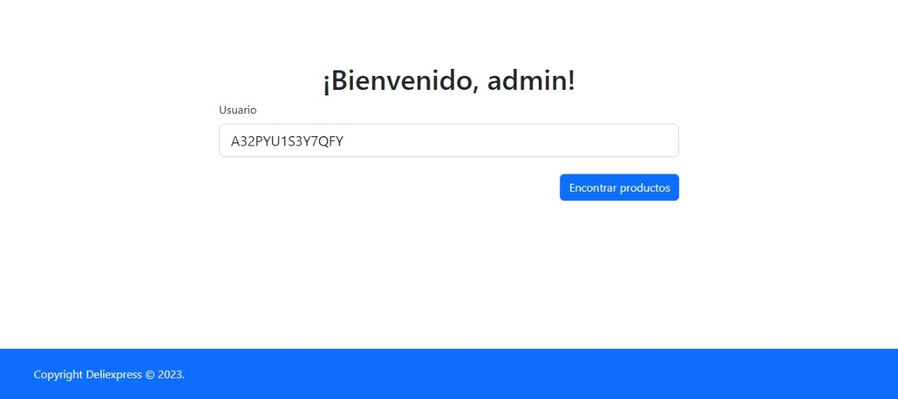

# Proyecto de Software Inteligente: Sistema de recomendación de usuarios
## 1. Descripción	
Sistema web que permite recomendar productos según el id de un usuario. Para ello se utiliza un modelo de aprendizaje automático que se entrena con un dataset de Amazon. El modelo se entrena con el algoritmo de factorización matricial, el cual se implementa con TensorFlow.

## 2. Instalación
1. Instalar Anaconda Navigator
2. Instalar las librerías de forma manual con los siguientes comandos:
```python
pip install Flask
pip install pandas
pip install numpy
pip install tensorflow
pip install -q tensorflow-recommenders
```

Agregar el dataset a la raiz del proyecto, con el nombre `ratings_Electronics (1).csv`, es decir ubicar el archivo en el mismo nivel que el archivo app.py

## 3. Ejecución
1. Ejecutar Anaconda Prompt y ubicarse en la carpeta del proyecto
2. Ejecutar el siguiente comando
```python
flask run
```

## 4. Uso
1. Ingresar a la siguiente URL: http://localhost:5000/
2. Ingresar el usuario y contraseña para iniciar sesión: <br />
    Usuario: <b>admin</b> <br />
    Contraseña: <b>admin</b>
    
3. Ingresar el id del usuario y presionar el botón "Encontrar productos"
    
4. Luego de la carga, se mostrará una lista de productos recomendados para el usuario
    

## 5. Integrantes
- Pasache Lopera, Luiggi
- Sánchez Alvarado, Marco Alejandro
- Silva Barra, Ernesto Franco
- Tocto Mallqui, Alexis
- Torres Rodriguez, Julian

